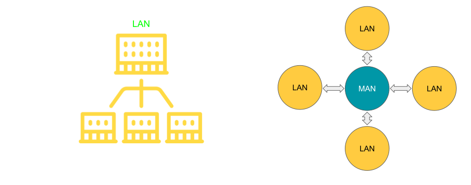
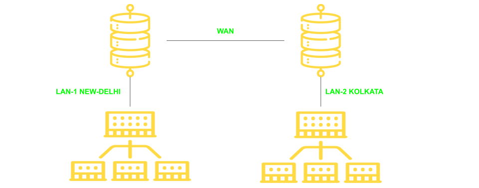

# Classification of Computer Networks

1. Local Area Network
2. Metropolitian Area Network
3. Wide Area Network

## 1. Local Area Network (LAN)

A Local Area Network is a computer network that interconnects computers within a **limited area** such as a residence, school, laboratory, university campus or office building.

Lan-Devices

- Wired LAN (Ethernet-Hub, switch)
- Wireless LAN (Wi-Fi)

## 2. Metropolitian Area Network

A metroPolitian area network is a computer network that interconnects users with computer resources in a geographic region of size of a **metropolitian area / city**.

- in other word two local area networks connected across city.

Man Devices

- Switches / Hub
- Routers / Bridges

## 3. Wide Area Network

A WAN is a **telecommunications network**(any communication at distance) that extends over a **large geographical area** for the primary pupose of computer netwoking.

WAN Devices

- End devices and Intermidiary devices

## Intenet

- Internet is the combination of Multiple LAN / MAN / WAN.

## Storage Area Network

### Cloud Computing

- It is the **on-demand availability** of computer syatem resources, especially data storage and computing power, without direct active management by the user.
