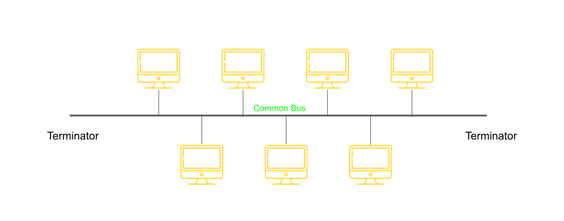
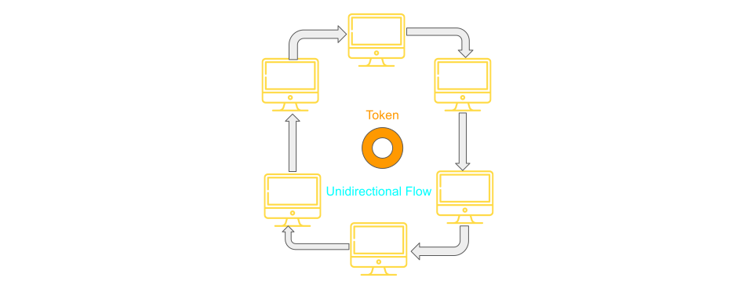
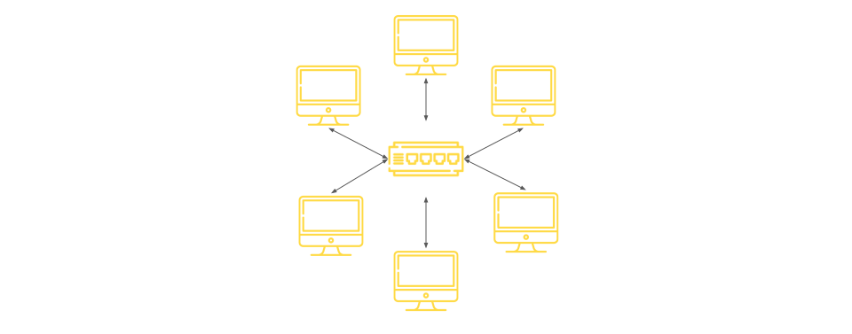
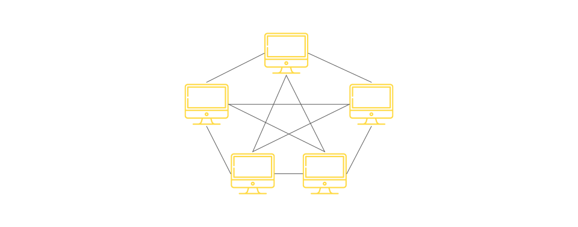
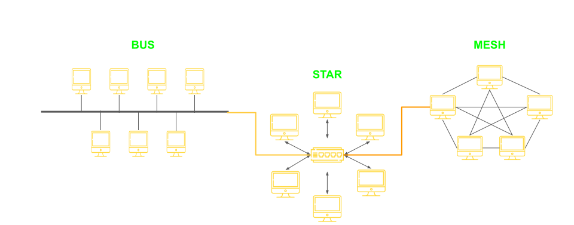

# Network Topology

Arrangement of nodes in computer network.

**Topology = Layout**

## Physical and Logical Topology

- Physical Topology - Placement of various nodes.
- Logical topology - Deals with the data flow in the network.

## Various types of Topology

- Bus
- Ring
- Star
- Mesh
- Hybrid

## 1. Bus Topology

All data transmitted between nodes in the network is transmitted over this **common transmission medium** and is able to receive by all nodes in the network simultaneously.

A signal containing the address of the intended receiving machine travel from a source machine in **both directions** to all machines connected to the bus until it finds the intended recipient.

| Advantages                          | Disadvantages                       |
| ----------------------------------- | ----------------------------------- |
| Only one wire - less expensive      | Not fault tollerant (no redundancy) |
| Suited for temprory network         | Limited cable length                |
| Node failure does not efeect others | No security                         |

## 2. Ring Topology

- A ring topology is a bus topology in a closed loop.
- Peer-To-Peer LAN topology.
- Two connections one to ech nearest neighbours.
- Unidirectional
- Sending and receiving data takes palce with the help of **Tokens**.

| No. of Nodes(N) | No. of Cables | No.of Port/Device | Total No of Ports |
| --------------- | ------------- | ----------------- | ----------------- |
| N               | N             | 2                 | 2 x N             |

| Advantages                             | Disadvantages                                                     |
| -------------------------------------- | ----------------------------------------------------------------- |
| Performance better than bus topology   | Unidirectional single point/node failure will effect whole netwok |
| Can cause bottleneck due to weak links | ↑ in load - ↓ in performance                                      |
| All nodes with equal access            | No Security                                                       |

## 3. Star Topology

- Every node is connected to a central node called a hub or switch.
- Centralized management.
- All trafic must pass through hub and switch.

| No. of Nodes(N) | No. of Cables | No.of Port/Device | Total No of Ports |
| --------------- | ------------- | ----------------- | ----------------- |
| N               | N             | 1                 | 2 x N             |

- all devices are connected to switch/hub which require N port too to connect them.
  

| Advantages                   | Disadvantages                                |
| ---------------------------- | -------------------------------------------- |
| Easy to design and emplement | Single point of failure effect whole network |
| Centralized administration   | Bottle neck due to overloaded switch/hub     |
| Scalable                     | Increase cost due to switches and hub        |

- Two or more star topology can be connected with the help of **repeater**.

## 4. Mesh Topology

- Each node is directly connected to every other nodes in the network.
- Fault tolerant and reliable.
- Trafic Problem can be minimized using mesh topology
  

| Advantages     | Disadvantages                              |
| -------------- | ------------------------------------------ |
| Fault tolerant | issue with broadcasting message            |
| Reliable       | Expensive and impratical for large network |

## 5. Hybrid Topology

- Cobination of All above topology.
  
