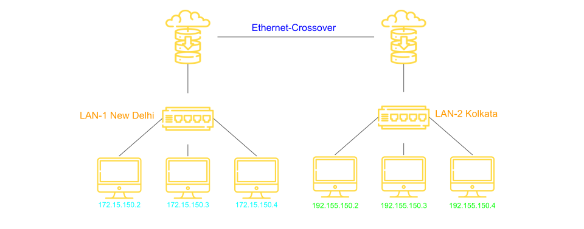
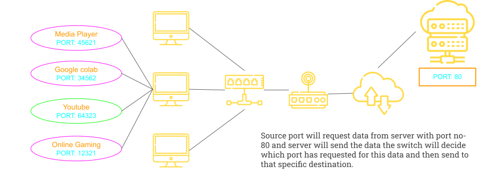

# Basics Of IP Address

IP Stands for internet Protocol.

Every node in the computer network is identified with the help of IP address.

## IPV4 Address

- IP address is a logic address .
- IP address can change based on the location of devices.
- IP address is Assigned manually or Dynamically.
- Represented in decimal and it has 4 octets(X.X.X.X)
- IP address can be in range of 0.0.0.0 to 255.255.255.255(32bits)



## Command to check IP address

```bash
ipconfig
#or
ip addr
```

# Basics of MAC Address

- MAC Stands for **Media Access Control.**
- Every node in the LAN is identified with the help of MAC Address.
- IP Address = Location of the Person(changes based on location)
- MAC Address(Not changes) = Name of the Person
- MAC address are physical address or Hardware address
- MAC Address are unique
- MAC address never changes
- Assigned by the manufacturer.
- Represented in Hexadecimal.
- Example : 70-20-84-ED-FC(48-bits)
- Separator: hyphen(-), period(.). and colon(:).

## Difference between IP Address and MAC Address

| IP Address                                 | MAC Address                                 |
| ------------------------------------------ | ------------------------------------------- |
| Needed for communication                   | Needed for communication                    |
| 32 bits                                    | 48 bits                                     |
| Represented in decimal                     | Represented in Hexa decimal                 |
| Routers need IP address to forward data    | Switch need MAC address to forward data     |
| Example: 10.10.23.56                       | Example: 70-20-84-OO-ED-FC                  |
| IP Addresses are Router friendly addresses | MAC Addresses are Switch friendly Addresses |

# Basics of PORT Addressing

Let's say i ordered a Laptop

- Parchel reached to my city is an example of **IP Address**
- Parchel reached to My Hostel is an example of **MAC Address**
- Parchel Reached to my room is an example of **Port Address**

## Port Address or Port Number

- In a node, many processes will be running.
- Data which are sent and received must reach the right process.
- Every process in a node is uniquely identified using **Port Number**
- Port = Communication endpoint
- Fixed port numbers and dynamic post numbers (0 - 65535)

Example:

Fixed port number like 25,80,3000(react),5000(django),5432(postgres)

OS Assingned dynamic port numbers:50321, 62414, . .



## Three key points to ponder

Before sending the data, any node must

- Attach Source IP Address and Destination IP address.(Required Router)
- Attach Sourcre MAC Address and Destnation MAC address.(Required for Switch)
- Attach Source PORT number and destination Port Number.(requrire for operating system)
