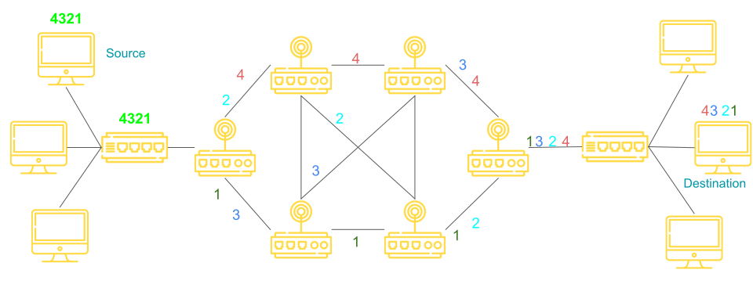
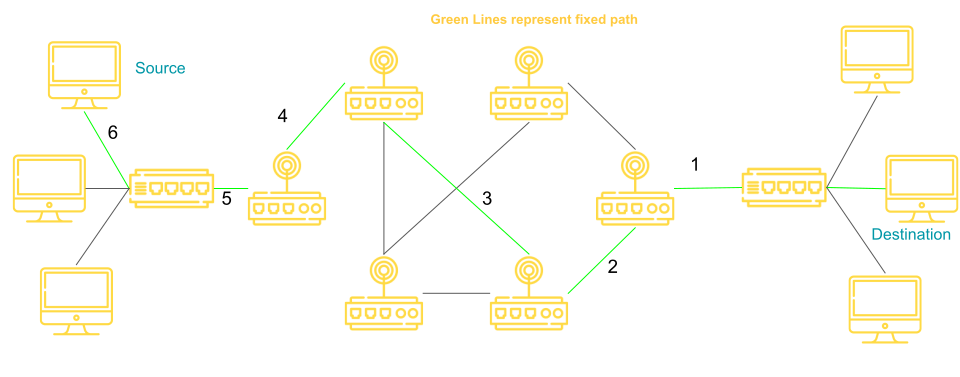

# Switching

Switching in Computer Network helps in deciding the best route for data transmission if there are multiple path in a large network.

- One-To-One Connection

## Switching Techniques

1. Circuit Switching
2. Message Switching
3. Packet Switching
   - Datagram Approach
   - Virtual Circuit Approach.

## 1. Circuit Switching

- A dedicated Path is established between the sender and receiver.
- Before data transfer, connections will be established first.
- Example: Telephone Network

### Three Phases in circuit Switching

1. Coonection establishment
2. Data Transfer
3. Connection Disconnection

## 2. Message Switching

- Store and forward mechanism
- Message is transferred as a complete unit and forwarded using store and forward mechanism at the intermidiary node.
- Not suited streaming media and real-time application.

## 3. Packet Switching

- The internet is a packet switched network.
- Message is broken into individual chunks called **packets.**
- Each packet is sent individually.
- Each packet will have **source and destination IP address** with sequence number.
- Sequence numbers will help the receiver to
  - Reorder the packets
  - Detect missing packets and
  - Send acknowledgement.

### DataGram Approach

- Datagram Packet Switching is also known as **connectionless switching.**
- Each independent entity is called as datagram.
- Datagrams contain destination information and the intermediary devices uses this information to forward datagrams to right destination.
- In datagram packet switching approach , the path is not fixed.
- Intermidiate nodes take the routing decisions to forward the packets.
  

### Virtual Circuit Approach

- vitual circuit switching is also known as coonection oriented switching.
- In case of virtual circuit switching a preplaned route is established before message are sent.
- Call request and call accept packets are used to establish the connection between sender and receiver.
- In this approach , the path is fixed for the duration of a logical connection.

