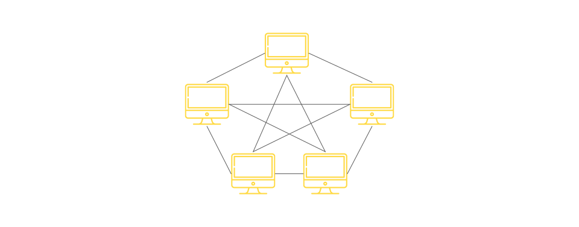
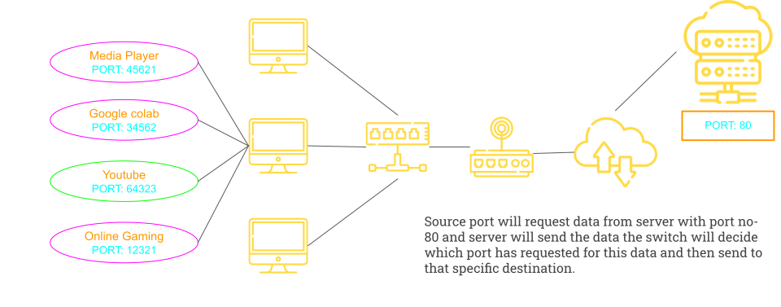
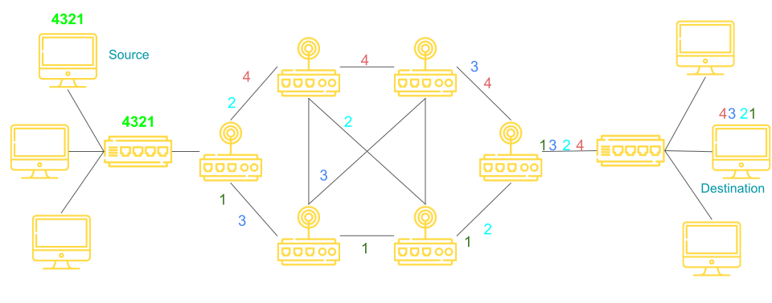

# What is a Computer Network ?

A computer network is a set of nodes connected by communication links.

## What is Node ?

A node can be computer, printer, or any other device capapable of sending and receiving data generated by other nodes in the network.

Examples:

- computer
- server
- printer
- Security camera
- Switches
- bridge
- routers
- etc . .

## What is communication link ?

A communication link can be wired or wirless link. Link carries the information.


A computer network is mainly used for resource sharing.

# Basic Charecteristics of computer Network

- Fault tolerance
- Scalability
- Quality of Service
- Security

## Fault tolerance

The ability to

- Continue working despite failure
- Ensuring no loss of service

## Scalability

The ability to

- Grow based on needs
- Have good performance after growth

## Quality of service

The ability to

- Set priorities (realtime call will get more priorities than an email sent by some user)
- Manage data trafic to reduce data loss, delay etc

# Security

The ability to prevent

- Unauthorized access
- Misuse
- Forgery

The abiltiy to provide

- Confidentiality
- Integrity
- Availability

# Network protocol and communication

## Data Communication

Data communications are the exchange of data between two nodes via some form of link (transmission medium) such as cable.

## Data Flow

Data flow means data is going to flow from one node to another node.

Three different flows are

- Simplex
- Half Duplex
- Full Duplex

### Simplex Dataflow

- Communication is always unidirectional
- One device can transmit and other will receive

  Examples:

  - Keyboard
  - Traditional monitors

### Half Duplex Dataflow

- Communication is in both direction but not at the same time.
- if one device is sending, the other can only receive and viceversa.

  Examples:

  - Walkie-Talkies

### Full Duplex Dataflow or Duplex

- Communication is both direction simultaniously.
- Davice can send and receive data at same time.
  Example:
  - Telephone Lines

## Protocols

All communication schemes will have the following things in common:

- Source or sender
- Destination or receiver
- Channel or media

Rules of protocol govern all methods of communication.

- Protocol = Rule
- It is a set of rules that govern data communication
- Protocol determines:
  - What is communicated?
  - How it is communicated?
  - When it is communicated?

### Need of Protocol in Network Communication

Protocols used in network communication also define :

- Message encoding
- Message formatting and encapsulation
- Message Timing
- Message Size
- Message Delivery option

These are called elements of protocol.

### 1. Message Encoding


### 2. Meesage Formatting and Encapsulation

A format on which Sender and Receiver both are aggred.

Encapsulate the information to identify the sender and receiver intigrity.

### 3. Message Size

Human break long message into smaller parts or sentences.

Long message must be broken into smaller part to travel across network.

### 4. Meesage Timing

Message timing deals with **flow control** and **response timeout**.

- flow control : if sender is very fast and receiver is slow than network should mannage the flow of messages .(if flow control is not available then chances of data loss is very high)
- response timeout - an approximate time to get response from sender message or reciever massage.

### 5. Message Delivery Option

- Unicast : One sender and One receiver
- MultiCast : one sender to set of receiver
- Broadcast : one sender to all receiver

## Peer to Peer Network

- No cetralized administration
- All peers are equal
- Simple sharing application
- Not Scalable

## Cleint Server Nework

- Centralized administration
- Request-response model
- Scalable
- Server may be overloaded


# Various Components of Computer network

1. Nodes
2. Media
3. Services

## 1. Nodes

A nodes can send or receive data.

- End Nodes (end devices)
- Intermediary nodes.

### End Nodes

Staring or end point of the communications.

- Computer
- Network printers
- Volp Phones
- Telepresence Endpoint(for video conferencing)
- Security camera

Mobile handheld devices (smart phones, tablets, PDAs, wireless debit/credit card reader, barcode scanner)

### Intermidiary Node

Node that just forwards the data from one node to another node.

- Switches
- Wireless access points
- Routers
- Security Devices (firewall)
- Bridges
- Hubs
- Repeaters
- Cell Tower

## 2. Media

Medial is also K/A Link that carries data.
This link can be :

- Wired Medium (Guided Medium) : Cable is present to guide the data flow hence guided medium.

  - Ethernet Straight through cable(connects different types of nodes)
  - Ethernet Crossover cable (connects similar type of nodes)
  - Fiber Optic Cable
  - Coaxial Cable
  - USB Cable

- Wireless Medium (Unguided Medium) : absence of cable hence unguided medium.
  - Infrared (short range communication - TV remote)
  - Radio (Bluetooth, wifi)
  - Microwaves ( Cellular systems)
  - Satalite (Long range communication - GPS)

## 3. Services

- e-mail
- Storage Service
- File Sharing
- Instant messaging
- Online game
- Voice over IP
- Video Telephony
- Wold Wide Web

# Classification of Computer Networks

1. Local Area Network
2. Metropolitian Area Network
3. Wide Area Network

## 1. Local Area Network (LAN)

A Local Area Network is a computer network that interconnects computers within a **limited area** such as a residence, school, laboratory, university campus or office building.

Lan-Devices

- Wired LAN (Ethernet-Hub, switch)
- Wireless LAN (Wi-Fi)

## 2. Metropolitian Area Network

A metroPolitian area network is a computer network that interconnects users with computer resources in a geographic region of size of a **metropolitian area / city**.

- in other word two local area networks connected across city.

Man Devices

- Switches / Hub
- Routers / Bridges


## 3. Wide Area Network

A WAN is a **telecommunications network**(any communication at distance) that extends over a **large geographical area** for the primary pupose of computer netwoking.

WAN Devices

- End devices and Intermidiary devices


## Intenet

- Internet is the combination of Multiple LAN / MAN / WAN.

## Storage Area Network

### Cloud Computing

- It is the **on-demand availability** of computer syatem resources, especially data storage and computing power, without direct active management by the user.

# Network Topology

Arrangement of nodes in computer network.

**Topology = Layout**

## Physical and Logical Topology

- Physical Topology - Placement of various nodes.
- Logical topology - Deals with the data flow in the network.

## Various types of Topology

- Bus
- Ring
- Star
- Mesh
- Hybrid

## 1. Bus Topology

All data transmitted between nodes in the network is transmitted over this **common transmission medium** and is able to receive by all nodes in the network simultaneously.

A signal containing the address of the intended receiving machine travel from a source machine in **both directions** to all machines connected to the bus until it finds the intended recipient.


| Advantages                          | Disadvantages                       |
| ----------------------------------- | ----------------------------------- |
| Only one wire - less expensive      | Not fault tollerant (no redundancy) |
| Suited for temprory network         | Limited cable length                |
| Node failure does not efeect others | No security                         |

## 2. Ring Topology

- A ring topology is a bus topology in a closed loop.
- Peer-To-Peer LAN topology.
- Two connections one to ech nearest neighbours.
- Unidirectional
- Sending and receiving data takes palce with the help of **Tokens**.

| No. of Nodes(N) | No. of Cables | No.of Port/Device | Total No of Ports |
| --------------- | ------------- | ----------------- | ----------------- |
| N               | N             | 2                 | 2 x N             |


| Advantages                             | Disadvantages                                                     |
| -------------------------------------- | ----------------------------------------------------------------- |
| Performance better than bus topology   | Unidirectional single point/node failure will effect whole netwok |
| Can cause bottleneck due to weak links | ↑ in load - ↓ in performance                                      |
| All nodes with equal access            | No Security                                                       |

## 3. Star Topology

- Every node is connected to a central node called a hub or switch.
- Centralized management.
- All trafic must pass through hub and switch.

| No. of Nodes(N) | No. of Cables | No.of Port/Device | Total No of Ports |
| --------------- | ------------- | ----------------- | ----------------- |
| N               | N             | 1                 | 2 x N             |

- all devices are connected to switch/hub which require N port too to connect them.
  

| Advantages                   | Disadvantages                                |
| ---------------------------- | -------------------------------------------- |
| Easy to design and emplement | Single point of failure effect whole network |
| Centralized administration   | Bottle neck due to overloaded switch/hub     |
| Scalable                     | Increase cost due to switches and hub        |

- Two or more star topology can be connected with the help of **repeater**.

## 4. Mesh Topology

- Each node is directly connected to every other nodes in the network.
- Fault tolerant and reliable.
- Trafic Problem can be minimized using mesh topology
  

| Advantages     | Disadvantages                              |
| -------------- | ------------------------------------------ |
| Fault tolerant | issue with broadcasting message            |
| Reliable       | Expensive and impratical for large network |

## 5. Hybrid Topology

- Cobination of All above topology.
  

# Basics Of IP Address

IP Stands for internet Protocol.

Every node in the computer network is identified with the help of IP address.

## IPV4 Address

- IP address is a logic address .
- IP address can change based on the location of devices.
- IP address is Assigned manually or Dynamically.
- Represented in decimal and it has 4 octets(X.X.X.X)
- IP address can be in range of 0.0.0.0 to 255.255.255.255(32bits)


## Command to check IP address

```bash
ipconfig
#or
ip addr
```

# Basics of MAC Address

- MAC Stands for **Media Access Control.**
- Every node in the LAN is identified with the help of MAC Address.
- IP Address = Location of the Person(changes based on location)
- MAC Address(Not changes) = Name of the Person
- MAC address are physical address or Hardware address
- MAC Address are unique
- MAC address never changes
- Assigned by the manufacturer.
- Represented in Hexadecimal.
- Example : 70-20-84-ED-FC(48-bits)
- Separator: hyphen(-), period(.). and colon(:).

## Difference between IP Address and MAC Address

| IP Address                                 | MAC Address                                 |
| ------------------------------------------ | ------------------------------------------- |
| Needed for communication                   | Needed for communication                    |
| 32 bits                                    | 48 bits                                     |
| Represented in decimal                     | Represented in Hexa decimal                 |
| Routers need IP address to forward data    | Switch need MAC address to forward data     |
| Example: 10.10.23.56                       | Example: 70-20-84-OO-ED-FC                  |
| IP Addresses are Router friendly addresses | MAC Addresses are Switch friendly Addresses |

# Basics of PORT Addressing

Let's say i ordered a Laptop

- Parchel reached to my city is an example of **IP Address**
- Parchel reached to My Hostel is an example of **MAC Address**
- Parchel Reached to my room is an example of **Port Address**

## Port Address or Port Number

- In a node, many processes will be running.
- Data which are sent and received must reach the right process.
- Every process in a node is uniquely identified using **Port Number**
- Port = Communication endpoint
- Fixed port numbers and dynamic post numbers (0 - 65535)

Example:

Fixed port number like 25,80,3000(react),5000(django),5432(postgres)

OS Assingned dynamic port numbers:50321, 62414, . .



## Three key points to ponder

Before sending the data, any node must

- Attach Source IP Address and Destination IP address.(Required Router)
- Attach Sourcre MAC Address and Destnation MAC address.(Required for Switch)
- Attach Source PORT number and destination Port Number.(requrire for operating system)

# Switching

Switching in Computer Network helps in deciding the best route for data transmission if there are multiple path in a large network.

- One-To-One Connection

## Switching Techniques

1. Circuit Switching
2. Message Switching
3. Packet Switching
   - Datagram Approach
   - Virtual Circuit Approach.

## 1. Circuit Switching

- A dedicated Path is established between the sender and receiver.
- Before data transfer, connections will be established first.
- Example: Telephone Network

### Three Phases in circuit Switching

1. Coonection establishment
2. Data Transfer
3. Connection Disconnection

## 2. Message Switching

- Store and forward mechanism
- Message is transferred as a complete unit and forwarded using store and forward mechanism at the intermidiary node.
- Not suited streaming media and real-time application.

## 3. Packet Switching

- The internet is a packet switched network.
- Message is broken into individual chunks called **packets.**
- Each packet is sent individually.
- Each packet will have **source and destination IP address** with sequence number.
- Sequence numbers will help the receiver to
  - Reorder the packets
  - Detect missing packets and
  - Send acknowledgement.

### DataGram Approach

- Datagram Packet Switching is also known as **connectionless switching.**
- Each independent entity is called as datagram.
- Datagrams contain destination information and the intermediary devices uses this information to forward datagrams to right destination.
- In datagram packet switching approach , the path is not fixed.
- Intermidiate nodes take the routing decisions to forward the packets.
  

### Virtual Circuit Approach

- vitual circuit switching is also known as coonection oriented switching.
- In case of virtual circuit switching a preplaned route is established before message are sent.
- Call request and call accept packets are used to establish the connection between sender and receiver.
- In this approach , the path is fixed for the duration of a logical connection.


# Layering in Computer Networks

Layering means decomposing the problems into more managable components(Layers).

### Advantages:

- It provides modular design
- Easy to troubleshoot

## Role of protocol in Layering

- Protocol is a set of rules that governs data communication.
- The protocol in each layer governs the activity of the data communication.

## Layered Architectures

1. The OSI Reference Model
2. The TCP/IP Model

## 1. The OSI Model

- OSI stands for **Open System Interconnection**
- It is a model for understanding and designing a network architecture that is **flexible** , **robust**(​strong and determined) and **iteroperable**(able to exchange and make use of information, like can be used on both windows and linux os).

- Developed by the international Standards for Organizations (**ISO**).
- **The OSI model is not a protocol**.
- It is only guideline and hence it is refered as OSI reference model.

### Purpose of OSI Model

- The pupose of OSI model is to show how to facilitate communication between different system without requiring changes to the logic of the underlying hardware and software.

- The OSI Model is never fully implemented.

## 2. The TCP/IP Model

- TCP/IP = Transmission Control Protocol / Internet Protocol
- The TCP/IP protocol suite was developed prior to the OSI Model.

- Therefore the layers in the TCP/IP protocol suite do not exactly match the osi model.
- **TCP/IP is a hirachical protocol** made up of interactive modules, each of which provides a specific functionality.

# OSI Refernce Model

The pupose of OSI model is to show how to facilitate communication between different system without requiring changes to the logic of the underlying hardware and software.

## Layers in OSI Reference Model

> Application Layer

> Presentation Layer

> Session Layer

> Transport Layer

> Network Layer

> Data Link Layer

> Physical Layer

Shortcut : **P**lease **D**o **N**o**T** **S** **P** **A**


