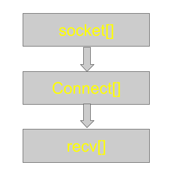
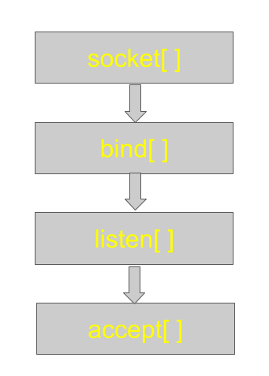

# Basics Linux Command to be Used

0. To Create a file

```
touch arp.txt
```

1. To open the file

```
vi arp.txt
```

2. To Open code Editor

```
vi filename.c

after that write your code
```

3. To Save the code

```
:wq
```

4. To Compile the code

```
gcc filename.c
```

5. To run the code

```
./a.out
```

# Basic FTP Command

## 1. Sending Data to other system

1. While Sending Data to other system first connect to your system and then put the data

   1. add your system ip
      ```
      ~ ftp "192.168.200.7"
      ~ connected
      ~ Name: roll1
      ~password: roll123
      ```
   2. to send information
      ```
      put arp.txt
      ```

2. To Receive data while connecting use the sender system IP address

```
ftp close

ftp open

ftp "192.168.200.9"

ftp roll1 -- username

ftp roll123 --password
```

3. to get out of ftp

```
ftp bye

or

ctrl + Z
```

# Socket Programming In C

## What are Sockets ?

- Sockets are the low level endpoint used for processing information across a network.

- Common networking protocols like HTTP, and FTP rely on sockets underneath to make connections.

## Client Socket Workflow

The client socket is created with a socket[] call, and connected to a remote address with the connect[] call, and then finally can retrieve data with the recv[] call.



**code:**

```c
#include <stdio.h>
#include <stdlib.h>

// for definition of socket functions we are using
#include <sys/types.h>
#include <sys/socket.h>

// to store address information
#include <netinet/in.h>

// specify the port
#define PORT 9002

int main()
{
	// crete a socket
	int networkSocket;

	// call the socket function
	networkSocket = socket(AF_INET, SOCK_STREAM, 0); // 0 means default protocol TCP

	// specify the address to connect to
	struct sockaddr_in server_address;

	// specify the address family
	server_address.sin_family = AF_INET;

	// specify the port
	// htons is used to covert int to the data format specified in this structure
	server_address.sin_port = htons(PORT);

	// specify the server address
	// INADDR_ANY means trying to connect to "0.0.0.0"
	server_address.sin_addr.s_addr = INADDR_ANY;

	// connect to another socket
	// connect return an integer and we can use it tom handle some error
	// if status is 0  the all good if it is negative the something is wrong
	int connection_status = connect(networkSocket, (struct sockaddr *)&server_address, sizeof(server_address));

	// print the status of the connection
	if (connection_status == -1)
	{
		printf("There is some error in the connection and connection code is %d\n", connection_status);
	}

	// Create a string to hold information sent by the server
	char server_response[256];
	// receive data from the server
	recv(networkSocket, &server_response, sizeof(server_response), 0);

	// show the received data
	printf("Response: %s\n", server_response);

	// close the socket
	close(networkSocket);
	return 0;
}
```

## Server Socket Workflow

On the "Server" end of thr socket, we need to also create a socket with a **socket[]** call, but then, we need to **bind[]** the socket to an ip and port where it can then **listen[]** for connections and then finally **accept[]** a connection and then **send[]** or **recv[]** data to the other sockets it has connected to.



**code:**

```c
#include<stdio.h>
#include<stdlib.h>
#include<sys/socket.h>
#include<sys/types.h>
#include<netinet/in.h>

#define PORT 9002

int main(){

	//create a string to hold data to send to client
	char server_message[256];
	printf("Please enter the message:");
	scanf("%s",server_message);

	//create an integer to hold return value of scoket call
	int server_socket;

	// socket call
	server_socket = socket(AF_INET,SOCK_STREAM,0);

	//define the address structure
	struct sockaddr_in server_address ;

	server_address.sin_family = AF_INET;

	server_address.sin_port = htons(PORT);

	server_address.sin_addr.s_addr = INADDR_ANY;

	//bind the socket to out specific IP and Port
	bind(server_socket,(struct sockaddr*) &server_address, sizeof(server_address));

	// now we can listen for connections
	// 5 is the no of client that can  connect to the socket
	listen(server_socket,5);

	// create a variable to hold the client socket
	int client_socket;

	//now we call the accept function
	//1st prameter is the socket we are accepting connection on
	//next two prams are for structure of address of client and sizeof that address
	client_socket = accept(server_socket,NULL,NULL);

	// send data to client socket
	send(client_socket,server_message, sizeof(server_message),0);

	//close the socket
	close(server_socket);
	return 0;
}

```
